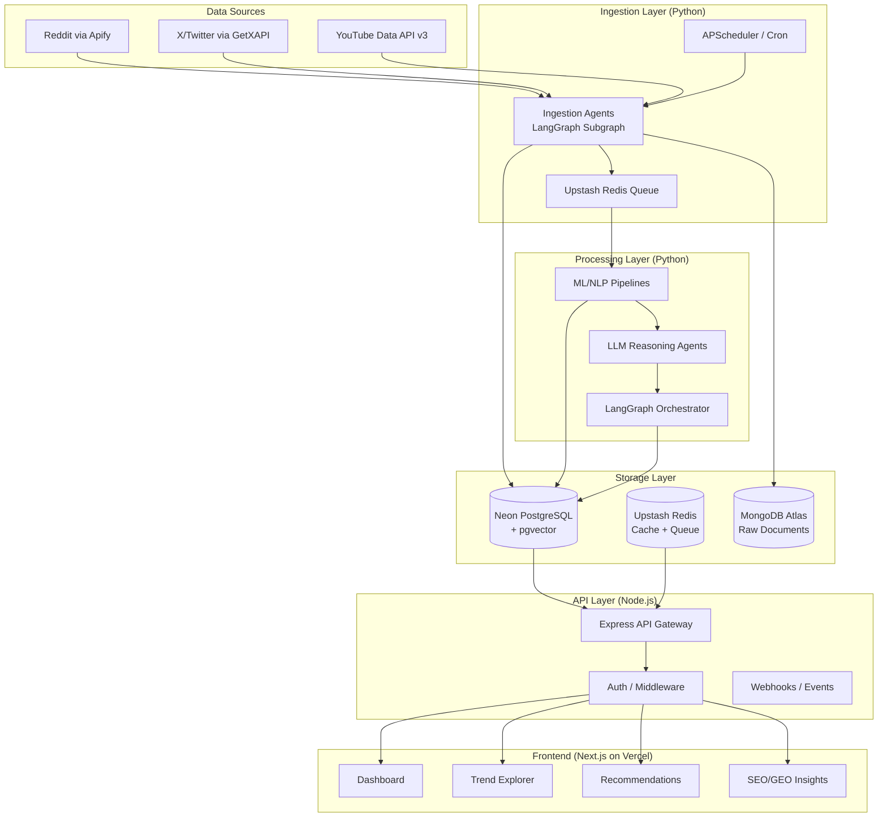

# 01 — System Overview: Market Research + SEO Intelligence Platform

## Vision

A production-grade, agent-based platform that continuously collects social/video platform data, detects trends, performs sentiment/emotion analysis, identifies viral outliers and content gaps, and generates actionable SEO + GEO-optimized content recommendations. It behaves like a **market research analyst + SEO strategist + content advisor**.

---

## High-Level Architecture



---

## System Layers

### 1. Data Ingestion Layer
| Concern | Solution |
|---|---|
| **Sources** | Reddit (Apify), X/Twitter (GetXAPI), YouTube (Official Data API v3) |
| **Scheduling** | APScheduler (Python) with configurable cron expressions |
| **Queueing** | Upstash Redis (BullMQ-compatible) for job distribution |
| **Deduplication** | Content hash + URL fingerprinting in Neon |
| **Retries** | Exponential backoff with dead-letter queue |
| **Rate Limits** | Per-API token bucket managed in Redis |

### 2. Storage Layer
| Database | Provider | Purpose |
|---|---|---|
| **PostgreSQL** | Neon | Primary relational data, processed analytics, user data |
| **pgvector** | Neon (extension) | Vector embeddings for semantic search & clustering |
| **Document Store** | MongoDB Atlas | Raw scraped data, unstructured JSON documents |
| **Cache + Queue** | Upstash Redis | Job queues, caching, rate limit counters, session store |

> [!IMPORTANT]
> Neon supports `pgvector` natively, eliminating the need for a separate vector database like Pinecone in the initial phase. This reduces costs and operational complexity. Pinecone can be added later if vector query volume exceeds pgvector's performance envelope.

### 3. ML / NLP Processing Layer
| Pipeline | Technology |
|---|---|
| **Sentiment Analysis** | `cardiffnlp/twitter-roberta-base-sentiment-latest` (HuggingFace) |
| **Emotion Detection** | `SamLowe/roberta-base-go_emotions` (HuggingFace) |
| **Topic Modeling** | BERTopic (HDBSCAN + sentence-transformers) |
| **Trend Detection** | Prophet + custom time-series (on Neon time-series views) |
| **Anomaly Detection** | Isolation Forest + Z-score on engagement metrics |
| **Embeddings** | `sentence-transformers/all-MiniLM-L6-v2` (384-dim) |

### 4. LLM Reasoning Layer
| Task | Model | Justification |
|---|---|---|
| **Insight Synthesis** | Gemini 2.5 Pro | Excellent reasoning, 1M context window, free tier for dev |
| **SEO Keyword Analysis** | Gemini 2.5 Flash | Hybrid reasoning, fast, $0.30/M in — great for classification |
| **GEO Optimization** | Gemini 2.5 Flash | Good structured output at low cost; swap to Claude for production |
| **Content Ideation** | Gemini 2.5 Pro | Creative + analytical balance for content angle generation |
| **Evaluation / Critic** | Gemini 2.5 Flash-Lite | Cheapest model ($0.10/M in) — perfect for pass/fail evaluation |

### 5. Agent Orchestration Layer
- **Framework**: LangGraph (StateGraph with typed Pydantic state)
- **Topology**: Multi-agent DAG with conditional routing and iterative refinement
- **Agents**: 8 specialized agents (see [02_agent_architecture.md](file:///C:/Users/bonsh/.gemini/antigravity/brain/5614d7e4-3238-4571-9305-bec38f564d91/02_agent_architecture.md))
- **State**: Shared typed state flowing through the graph

### 6. API & Deployment Layer
| Concern | Technology |
|---|---|
| **Framework** | Express.js (TypeScript) |
| **Hosting** | **AWS EC2** (`t3.medium`, Docker Compose) — both Node.js + Python on one instance |
| **Auth** | NextAuth.js (shared with frontend) or JWT |
| **API Style** | REST + WebSocket for real-time updates |
| **Python Bridge** | HTTP calls to FastAPI Python service (co-hosted on EC2) |
| **Scheduling** | Node-cron triggers → Python pipeline via Redis queue |

### 7. Frontend (Next.js)
| Feature | Implementation |
|---|---|
| **Dashboard** | Real-time KPIs, trend sparklines, alert feed |
| **Trend Explorer** | Interactive timeline, topic clusters, sentiment heatmaps |
| **Recommendations** | Ranked content ideas with SEO scores and confidence |
| **SEO/GEO Panel** | Keyword opportunities, SERP analysis, GEO-optimized outlines |
| **Hosting** | Vercel with ISR (Incremental Static Regeneration) |

---

## Data Flow Summary

```
Apify Actors (scheduled)
    → Raw data → MongoDB Atlas
    → Cleaned/structured → Neon PostgreSQL
    → Embeddings → Neon pgvector
    → ML pipelines (sentiment, topics, trends)
    → LangGraph agent orchestration
    → LLM reasoning (insights, SEO, GEO, recommendations)
    → Evaluated/refined output → Neon
    → Node.js API → Next.js Dashboard
```

---

## Key Architectural Decisions

| Decision | Rationale |
|---|---|
| **Neon pgvector instead of Pinecone** | Reduces vendor count, Neon supports HNSW indexes; Pinecone reserved for scale-out |
| **MongoDB Atlas instead of local document store** | Managed, cloud-hosted, excellent for raw JSON; flexible schema for varied scraped data |
| **Upstash Redis instead of self-hosted** | Serverless, pay-per-request, BullMQ-compatible, multi-region |
| **No separate time-series DB initially** | PostgreSQL with proper indexing + materialized views handles trend queries; TimescaleDB Cloud can be added if needed |
| **Python for ML + Node.js for API** | Python has superior ML/NLP ecosystem; Node.js excels at API gateway, auth, real-time |
| **LangGraph over raw LangChain chains** | Explicit state management, conditional routing, iterative loops required for multi-agent evaluation |
