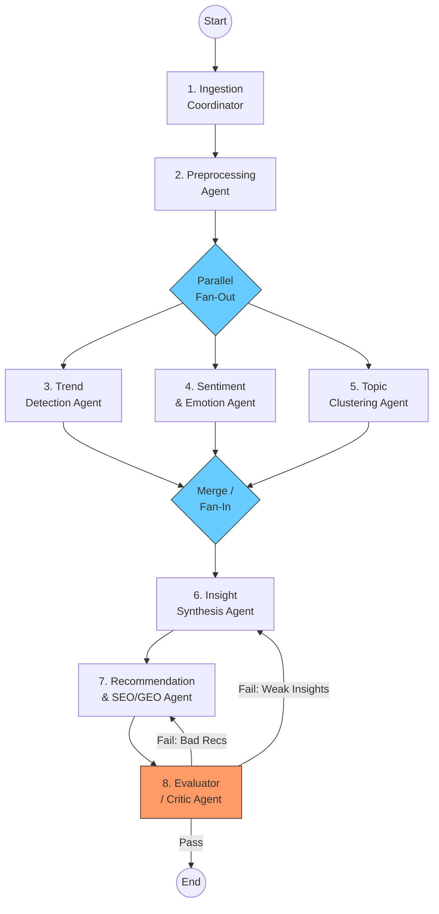

# 02 — Agent Architecture: LangGraph Topology & Agent Roles

## Overview

The platform uses **LangGraph's StateGraph** to orchestrate 8 specialized agents in a directed acyclic graph (DAG) with conditional routing and iterative refinement loops. Each agent is a node in the graph that reads from and writes to a shared typed state.

---

## LangGraph Topology



---

## Agent Definitions

### Agent 1: Ingestion Coordinator
| Property | Value |
|---|---|
| **Role** | Orchestrate data fetching from Reddit, X, YouTube via Apify |
| **Input** | Schedule trigger, platform configs, last-fetched timestamps |
| **Output** | Raw data batches written to MongoDB Atlas, fetch metadata to state |
| **Tools** | `apify_reddit_scraper`, `apify_twitter_scraper`, `apify_youtube_scraper` |
| **Error Handling** | Retry with exponential backoff; partial success accepted; dead-letter failed batches |
| **Model** | None (pure tool orchestration) |

```python
# Pseudocode
class IngestionCoordinator:
    tools = [ApifyRedditTool, ApifyTwitterTool, ApifyYouTubeTool]
    
    async def run(self, state: PlatformState) -> dict:
        # Fetch from all platforms in parallel
        tasks = [self.fetch_with_retry(p) for p in state.active_platforms]
        results = await asyncio.gather(*tasks)
        
        for platform, raw_data in zip(state.active_platforms, results):
            await self.store_raw(raw_data)  # → MongoDB
            state.ingestion_metadata[platform] = {
                "count": len(raw_data),
                "timestamp": now(),
                "status": "success"
            }
        return {"ingestion_metadata": state.ingestion_metadata}
```

### Agent 2: Preprocessing Agent
| Property | Value |
|---|---|
| **Role** | Clean, normalize, deduplicate, and structure raw data |
| **Input** | Raw data references from ingestion metadata |
| **Output** | Cleaned records in Neon PostgreSQL + embeddings in pgvector |
| **Operations** | Text cleaning, language detection, dedup via content hashing, embedding generation |
| **Model** | `sentence-transformers/all-MiniLM-L6-v2` for embeddings |

Key operations:
- Remove HTML, normalize Unicode, strip URLs/mentions
- Detect language (filter to English or configurable)
- Generate content hash for deduplication
- Compute 384-dim embeddings via sentence-transformers
- Store structured records in Neon, embeddings in pgvector

### Agent 3: Trend Detection Agent
| Property | Value |
|---|---|
| **Role** | Detect emerging, peaking, and declining trends across time windows |
| **Input** | Cleaned data with timestamps and engagement metrics from Neon |
| **Output** | Trend signals with momentum scores, direction, and confidence |
| **Algorithms** | Moving averages, Prophet forecasting, rate-of-change analysis |
| **Model** | None (statistical/ML) |

Trend detection logic:
```python
# Momentum = weighted engagement growth rate over sliding windows
momentum_7d = (engagement_current_7d - engagement_prev_7d) / engagement_prev_7d
momentum_30d = (engagement_current_30d - engagement_prev_30d) / engagement_prev_30d

# Trend classification
if momentum_7d > 0.5 and momentum_30d > 0.2:
    trend = "emerging"
elif momentum_7d < -0.3 and momentum_30d < -0.1:
    trend = "declining"
elif engagement_current_7d > percentile_95:
    trend = "viral"
else:
    trend = "stable"
```

### Agent 4: Sentiment & Emotion Agent
| Property | Value |
|---|---|
| **Role** | Classify sentiment (positive/negative/neutral) and emotions per content item and topic |
| **Input** | Cleaned text data from Neon |
| **Output** | Per-item sentiment/emotion labels + aggregated scores per topic/trend |
| **Models** | `cardiffnlp/twitter-roberta-base-sentiment-latest`, `SamLowe/roberta-base-go_emotions` |
| **Aggregation** | Weighted by engagement (upvotes, likes, views) |

Emotion taxonomy (GoEmotions):
> admiration, amusement, anger, annoyance, approval, caring, confusion, curiosity, desire, disappointment, disapproval, disgust, embarrassment, excitement, fear, gratitude, grief, joy, love, nervousness, optimism, pride, realization, relief, remorse, sadness, surprise, neutral

### Agent 5: Topic Clustering Agent
| Property | Value |
|---|---|
| **Role** | Discover topic clusters from content using semantic similarity |
| **Input** | Embeddings from pgvector, text data from Neon |
| **Output** | Topic clusters with labels, representative docs, inter-topic distances |
| **Algorithm** | BERTopic (UMAP dimensionality reduction → HDBSCAN clustering → c-TF-IDF topic representation) |
| **Model** | Leverages existing embeddings from Agent 2 |

BERTopic pipeline:
```
Embeddings (384-dim)
  → UMAP (reduce to 5-dim)
  → HDBSCAN (density-based clustering)
  → c-TF-IDF (extract topic keywords)
  → LLM label generation (optional, via GPT-4o-mini)
```

### Agent 6: Insight Synthesis Agent
| Property | Value |
|---|---|
| **Role** | Synthesize ML outputs into actionable market insights using LLM reasoning |
| **Input** | Trends, sentiments, topics, anomalies from Agents 3–5 |
| **Output** | Structured insights: content gaps, viral patterns, audience signals |
| **Model** | GPT-4o (high reasoning quality needed for cross-signal analysis) |
| **Prompt Strategy** | Structured JSON output with chain-of-thought reasoning |

Key outputs:
- **Content Gaps**: Topics with high search interest but low content supply
- **Viral Patterns**: Common attributes of outlier content
- **Audience Signals**: Shifting sentiment, emerging questions, unmet needs
- **Competitive Landscape**: What competitors are covering vs. missing

### Agent 7: Recommendation & SEO/GEO Agent
| Property | Value |
|---|---|
| **Role** | Generate niche-specific, SEO-optimized, GEO-aware content recommendations |
| **Input** | Insights from Agent 6, trend signals, topic clusters |
| **Output** | Ranked content ideas with titles, outlines, keywords, GEO guidance, confidence scores |
| **Models** | GPT-4o (ideation), GPT-4o-mini (keyword analysis), Claude 3.5 Sonnet (GEO structuring) |

Output schema:
```json
{
  "recommendations": [
    {
      "title": "How AI is Transforming Remote Work in 2025",
      "content_angle": "Contrarian take on productivity paradox",
      "target_keywords": ["AI remote work", "productivity AI tools"],
      "keyword_intent": "informational",
      "seo_score": 0.82,
      "geo_optimization": {
        "structured_answer_format": true,
        "key_entities": ["AI", "remote work", "productivity"],
        "citation_worthy_claims": 3,
        "recommended_structure": "listicle with data points"
      },
      "confidence": 0.78,
      "reasoning": "High search volume + emerging trend + low competition..."
    }
  ]
}
```

### Agent 8: Evaluator / Critic Agent
| Property | Value |
|---|---|
| **Role** | Validate quality of insights and recommendations; gate the pipeline output |
| **Input** | Full state including insights and recommendations |
| **Output** | Pass/fail decision with feedback; triggers re-routing if quality is low |
| **Model** | GPT-4o-mini (fast, cheap for evaluation) |
| **Checks** | Confidence thresholds, hallucination detection, correlation strength, actionability |

Evaluation criteria:
```python
class EvaluationResult(BaseModel):
    overall_pass: bool
    confidence_score: float          # 0.0 - 1.0
    insight_quality: float           # Are insights substantiated by data?
    recommendation_actionability: float  # Are recs specific and executable?
    hallucination_risk: float        # Likelihood of unsupported claims
    correlation_strength: float      # Are trends-to-insights links valid?
    feedback: str                    # Specific improvement suggestions
    route_to: Literal["end", "insight_agent", "recommendation_agent"]
```

Routing logic:
```python
def evaluation_router(state: PlatformState) -> str:
    eval_result = state.evaluation
    if eval_result.overall_pass and eval_result.confidence_score > 0.7:
        return "end"
    elif eval_result.insight_quality < 0.5:
        return "insight_agent"       # Re-run insight synthesis
    elif eval_result.recommendation_actionability < 0.5:
        return "recommendation_agent"  # Re-run recommendations
    else:
        return "end"  # Accept with caveats after max retries
```

---

## Conditional Routing & Refinement Loops

| Condition | Route | Max Iterations |
|---|---|---|
| Evaluation passes (confidence > 0.7) | → END | — |
| Weak insights (quality < 0.5) | → Agent 6 (Insight Synthesis) | 2 |
| Poor recommendations (actionability < 0.5) | → Agent 7 (Recommendation) | 2 |
| Max retries exceeded | → END with warnings | — |

> [!WARNING]
> Refinement loops are capped at 2 iterations to prevent infinite loops and excessive LLM costs. After max retries, results are returned with low-confidence warnings attached.

---

## State Flow Between Agents

```
Agent 1 (Ingestion) → writes: ingestion_metadata
Agent 2 (Preprocessing) → writes: cleaned_data_refs, embedding_refs
Agent 3 (Trends) → writes: trend_signals
Agent 4 (Sentiment) → writes: sentiment_summary, emotion_summary
Agent 5 (Topics) → writes: topic_clusters
Agent 6 (Insights) → writes: insights, content_gaps, viral_patterns
Agent 7 (Recommendations) → writes: recommendations, seo_analysis, geo_guidance
Agent 8 (Evaluator) → writes: evaluation, route_to
```

---

## LangGraph Implementation Pattern

```python
from langgraph.graph import StateGraph, END
from typing import TypedDict, Literal

# Build the graph
workflow = StateGraph(PlatformState)

# Add nodes
workflow.add_node("ingestion", ingestion_coordinator)
workflow.add_node("preprocessing", preprocessing_agent)
workflow.add_node("trend_detection", trend_detection_agent)
workflow.add_node("sentiment_emotion", sentiment_emotion_agent)
workflow.add_node("topic_clustering", topic_clustering_agent)
workflow.add_node("insight_synthesis", insight_synthesis_agent)
workflow.add_node("recommendation", recommendation_agent)
workflow.add_node("evaluator", evaluator_agent)

# Sequential edges
workflow.set_entry_point("ingestion")
workflow.add_edge("ingestion", "preprocessing")

# Fan-out to parallel ML agents
workflow.add_edge("preprocessing", "trend_detection")
workflow.add_edge("preprocessing", "sentiment_emotion")
workflow.add_edge("preprocessing", "topic_clustering")

# Fan-in to insight synthesis (waits for all 3)
workflow.add_edge("trend_detection", "insight_synthesis")
workflow.add_edge("sentiment_emotion", "insight_synthesis")
workflow.add_edge("topic_clustering", "insight_synthesis")

# Sequential to recommendation
workflow.add_edge("insight_synthesis", "recommendation")
workflow.add_edge("recommendation", "evaluator")

# Conditional routing from evaluator
workflow.add_conditional_edges(
    "evaluator",
    evaluation_router,
    {
        "end": END,
        "insight_agent": "insight_synthesis",
        "recommendation_agent": "recommendation",
    }
)

app = workflow.compile()
```
