# 03 — Data Pipeline: Ingestion, Processing & Storage

## Ingestion Architecture

### Platform → API Mapping

| Platform | API | Cost | Data Extracted | Batch Size | Schedule |
|---|---|---|---|---|---|
| **Reddit** | Apify (`trudax/reddit-scraper`) | ~$49/mo (Apify plan) | Posts, comments, scores, subreddits | 500 posts/run | Every 4 hours |
| **X (Twitter)** | [GetXAPI](https://docs.getxapi.com/docs) | $0.001/API call | Tweets, replies, likes, retweets, views, author data | 20 tweets/page (paginated) | Every 2 hours |
| **YouTube** | YouTube Data API v3 (Official) | Free (10K quota units/day) | Videos, titles, descriptions, views, likes, comments | 50 videos/page | Every 6 hours |

> [!NOTE]
> - **Reddit**: Apify remains the best option — no official free API for bulk data.
> - **X/Twitter**: GetXAPI is a cost-effective alternative ($0.001/call). No monthly plan required — pure pay-per-call.
> - **YouTube**: Official YouTube Data API v3 is free with 10,000 quota units/day (sufficient for ~100 search + video detail calls).

---

### Reddit Integration (Apify)
 
 ```python
 from apify_client import ApifyClient
 import asyncio
 
 client = ApifyClient(token=os.environ["APIFY_TOKEN"])
 
 async def fetch_reddit_data(subreddits: list[str], limit: int = 500):
     # Run in thread to not block main event loop
     run = await asyncio.to_thread(
         client.actor("trudax/reddit-scraper").call,
         run_input={
             "startUrls": [{"url": f"https://reddit.com/r/{sub}"} for sub in subreddits],
             "maxItems": limit,
             "sort": "hot",
             "proxy": {"useApifyProxy": True}
         },
         timeout_secs=300,
         memory_mbytes=512
     )
     dataset = client.dataset(run["defaultDatasetId"])
     dataset_items = await asyncio.to_thread(dataset.list_items)
     items = dataset_items.items
     return items
 ```

### X/Twitter Integration (GetXAPI)

```python
import httpx

GETXAPI_BASE = "https://api.getxapi.com"
GETXAPI_KEY = os.environ["GETXAPI_API_KEY"]

async def fetch_twitter_data(query: str, max_pages: int = 50) -> list[dict]:
    """
    Fetch tweets via GetXAPI advanced search.
    Cost: $0.001 per API call (~20 tweets/call).
    50 pages = 50 calls = $0.05 = ~1000 tweets.
    """
    headers = {"Authorization": f"Bearer {GETXAPI_KEY}"}
    all_tweets = []
    cursor = None
    
    for page in range(max_pages):
        params = {"q": query, "product": "Latest"}
        if cursor:
            params["cursor"] = cursor
        
        resp = await httpx.AsyncClient().get(
            f"{GETXAPI_BASE}/twitter/tweet/advanced_search",
            headers=headers,
            params=params
        )
        data = resp.json()
        all_tweets.extend(data.get("tweets", []))
        
        if not data.get("has_more", False):
            break
        cursor = data.get("next_cursor")
    
    return all_tweets

# Query examples (supports Twitter advanced search operators):
# "AI tools" min_faves:100 since:2025-01-01
# from:openai OR from:google
# #machinelearning lang:en
```

**GetXAPI response includes per tweet:**
- `id`, `url`, `text`, `source`
- `likeCount`, `retweetCount`, `replyCount`, `quoteCount`, `viewCount`, `bookmarkCount`
- `createdAt`, `lang`, `isReply`, `conversationId`
- `author` (username, followers, following, verified status, profile picture)
- `media` (images, videos)
- `quoted_tweet` (if applicable)

### YouTube Integration (Official YouTube Data API v3)

```python
from googleapiclient.discovery import build

youtube = build("youtube", "v3", developerKey=os.environ["YOUTUBE_API_KEY"])

async def search_youtube_videos(query: str, max_results: int = 50) -> list[dict]:
    """
    Search YouTube videos. Quota cost: 100 units per search.list call.
    With 10K units/day: ~100 search calls/day.
    """
    request = youtube.search().list(
        q=query,
        part="snippet",
        type="video",
        maxResults=min(max_results, 50),
        order="relevance",
        publishedAfter="2025-01-01T00:00:00Z"
    )
    response = request.execute()
    
    video_ids = [item["id"]["videoId"] for item in response["items"]]
    return await get_video_details(video_ids)

async def get_video_details(video_ids: list[str]) -> list[dict]:
    """
    Get detailed video stats. Quota cost: 1 unit per video.
    """
    request = youtube.videos().list(
        part="snippet,statistics,contentDetails",
        id=",".join(video_ids)
    )
    response = request.execute()
    
    return [{
        "video_id": item["id"],
        "title": item["snippet"]["title"],
        "description": item["snippet"]["description"],
        "channel_id": item["snippet"]["channelId"],
        "channel_title": item["snippet"]["channelTitle"],
        "published_at": item["snippet"]["publishedAt"],
        "tags": item["snippet"].get("tags", []),
        "views": int(item["statistics"].get("viewCount", 0)),
        "likes": int(item["statistics"].get("likeCount", 0)),
        "comments": int(item["statistics"].get("commentCount", 0)),
        "duration": item["contentDetails"]["duration"],
    } for item in response["items"]]
```

**YouTube API Quota Budget (10K units/day):**
| Operation | Cost | Daily Budget |
|---|---|---|
| `search.list` | 100 units | ~60 calls (6K units) |
| `videos.list` | 1 unit/video | ~3000 videos (3K units) |
| `commentThreads.list` | 1 unit | ~1000 calls (1K units) |

---

### Scheduling Strategy

```mermaid
gantt
    title Ingestion Schedule (24h cycle)
    dateFormat HH:mm
    axisFormat %H:%M
    
    section Reddit (Apify)
    Batch 1    :r1, 00:00, 30min
    Batch 2    :r2, 04:00, 30min
    Batch 3    :r3, 08:00, 30min
    Batch 4    :r4, 12:00, 30min
    Batch 5    :r5, 16:00, 30min
    Batch 6    :r6, 20:00, 30min
    
    section Twitter (GetXAPI)
    Batch 1    :t1, 00:00, 20min
    Batch 2    :t2, 02:00, 20min
    Batch 3    :t3, 04:00, 20min
    Batch 4    :t4, 06:00, 20min
    Batch 5    :t5, 08:00, 20min
    Batch 6    :t6, 10:00, 20min
    
    section YouTube (Official API)
    Batch 1    :y1, 00:00, 45min
    Batch 2    :y2, 06:00, 45min
    Batch 3    :y3, 12:00, 45min
    Batch 4    :y4, 18:00, 45min
```



### Error Handling & Retries

```python
class IngestionRetryPolicy:
    max_retries: int = 3
    base_delay_seconds: float = 5.0
    max_delay_seconds: float = 300.0
    backoff_multiplier: float = 2.0
    
    # Per-platform retryable errors
    retryable_errors = {
        "apify":   ["rate-limit-exceeded", "timeout", "proxy-error"],
        "getxapi": ["rate-limit-exceeded", "timeout", "5xx"],
        "youtube": ["quotaExceeded", "rateLimitExceeded", "backendError"],
    }
```

### Dead Letter Queue (DLQ)

Failed ingestion jobs after max retries are pushed to an Upstash Redis dead-letter queue for manual inspection:

```
Queue: "ingestion:dlq"
Payload: {
    platform: "twitter",
    api: "getxapi",
    input: {query: "AI tools", ...},
    error: "rate-limit after 3 retries",
    timestamp: "2025-...",
    run_id: "abc123"
}
```

---

## Data Processing Pipeline

### Stage 1: Raw Data Storage (MongoDB Atlas)

Raw API responses are stored as-is in MongoDB Atlas for audit and replay:

```
Collection: raw_reddit_posts      (from Apify)
Collection: raw_twitter_tweets    (from GetXAPI)
Collection: raw_youtube_videos    (from YouTube Data API)
```

Each document includes:
- `_id`: Auto-generated or platform-specific ID
- `raw_data`: Full API response object
- `fetch_timestamp`: When data was fetched
- `batch_id`: Links to ingestion run
- `api_source`: "apify" | "getxapi" | "youtube_data_api"
- `processed`: Boolean flag

### Stage 2: Cleaning & Normalization

| Operation | Description |
|---|---|
| **HTML Stripping** | Remove HTML tags from Reddit post bodies |
| **Unicode Normalization** | NFC normalize, strip control characters |
| **URL Extraction** | Extract and separately store URLs from text |
| **Mention Extraction** | Extract @mentions, u/ references |
| **Language Detection** | `langdetect` library; filter to configured languages |
| **Timestamp Normalization** | Convert all timestamps to UTC ISO 8601 |

### Stage 3: Deduplication

```python
import hashlib

def content_fingerprint(text: str, platform: str, author: str) -> str:
    """Generate a unique fingerprint for deduplication."""
    normalized = text.lower().strip()
    normalized = re.sub(r'https?://\S+', '', normalized)
    normalized = re.sub(r'@\w+', '', normalized)
    return hashlib.sha256(
        f"{platform}:{author}:{normalized}".encode()
    ).hexdigest()
```

Dedup check: `INSERT ... ON CONFLICT (content_hash) DO UPDATE SET last_seen = NOW()`

### Stage 4: Embedding Generation

| Model | Dimensions | Speed | Use Case |
|---|---|---|---|
| `all-MiniLM-L6-v2` | 384 | ~14k sentences/sec (GPU) | Default — good balance |
| `all-mpnet-base-v2` | 768 | ~2k sentences/sec (GPU) | Higher quality if needed |

Embeddings are batch-generated and stored in Neon's pgvector column.

---

## Unified Data Schema (Neon PostgreSQL)

### Core Tables

```sql
-- Platform content (unified across Reddit, X, YouTube)
CREATE TABLE content_items (
    id              UUID PRIMARY KEY DEFAULT gen_random_uuid(),
    platform        VARCHAR(20) NOT NULL,  -- 'reddit', 'twitter', 'youtube'
    platform_id     VARCHAR(255) NOT NULL,  -- Original platform ID
    content_type    VARCHAR(50) NOT NULL,  -- 'post', 'tweet', 'video', 'comment'
    title           TEXT,
    body            TEXT,
    author          VARCHAR(255),
    url             TEXT,
    content_hash    VARCHAR(64) UNIQUE NOT NULL,
    language        VARCHAR(10) DEFAULT 'en',
    
    -- Engagement metrics
    upvotes         INTEGER DEFAULT 0,
    downvotes       INTEGER DEFAULT 0,
    likes           INTEGER DEFAULT 0,
    views           BIGINT DEFAULT 0,
    comments_count  INTEGER DEFAULT 0,
    shares          INTEGER DEFAULT 0,
    
    -- Metadata
    platform_created_at TIMESTAMPTZ,
    fetched_at      TIMESTAMPTZ DEFAULT NOW(),
    processed_at    TIMESTAMPTZ,
    batch_id        VARCHAR(100),
    
    -- Vector embedding
    embedding       vector(384),
    
    UNIQUE(platform, platform_id)
);

CREATE INDEX idx_content_platform_time ON content_items(platform, platform_created_at DESC);
CREATE INDEX idx_content_hash ON content_items(content_hash);
CREATE INDEX idx_content_embedding ON content_items 
    USING hnsw (embedding vector_cosine_ops) WITH (m = 16, ef_construction = 64);

-- Sentiment & Emotion results
CREATE TABLE sentiment_results (
    id              UUID PRIMARY KEY DEFAULT gen_random_uuid(),
    content_id      UUID REFERENCES content_items(id),
    sentiment       VARCHAR(20),
    sentiment_score FLOAT,
    emotions        JSONB,
    analyzed_at     TIMESTAMPTZ DEFAULT NOW()
);

-- Topic clusters
CREATE TABLE topic_clusters (
    id              UUID PRIMARY KEY DEFAULT gen_random_uuid(),
    cluster_label   TEXT,
    keywords        TEXT[],
    representative_docs UUID[],
    doc_count       INTEGER,
    avg_sentiment   FLOAT,
    created_at      TIMESTAMPTZ DEFAULT NOW(),
    analysis_run_id VARCHAR(100)
);

-- Trend signals
CREATE TABLE trend_signals (
    id              UUID PRIMARY KEY DEFAULT gen_random_uuid(),
    topic_cluster_id UUID REFERENCES topic_clusters(id),
    keyword         TEXT,
    platform        VARCHAR(20),
    direction       VARCHAR(20),
    momentum_7d     FLOAT,
    momentum_30d    FLOAT,
    volume_current  INTEGER,
    volume_previous INTEGER,
    confidence      FLOAT,
    detected_at     TIMESTAMPTZ DEFAULT NOW()
);

-- Recommendations
CREATE TABLE recommendations (
    id              UUID PRIMARY KEY DEFAULT gen_random_uuid(),
    title           TEXT NOT NULL,
    content_angle   TEXT,
    target_keywords TEXT[],
    keyword_intent  VARCHAR(50),
    seo_score       FLOAT,
    geo_optimization JSONB,
    confidence      FLOAT,
    reasoning       TEXT,
    source_trends   UUID[],
    source_insights JSONB,
    evaluation_score FLOAT,
    created_at      TIMESTAMPTZ DEFAULT NOW(),
    analysis_run_id VARCHAR(100)
);

-- Analysis runs
CREATE TABLE analysis_runs (
    id              VARCHAR(100) PRIMARY KEY,
    started_at      TIMESTAMPTZ DEFAULT NOW(),
    completed_at    TIMESTAMPTZ,
    status          VARCHAR(20),
    platforms_processed TEXT[],
    items_processed INTEGER,
    evaluation_score FLOAT,
    metadata        JSONB
);
```

---

## Data Flow Summary

```
1. Scheduled trigger (APScheduler / cron)
2. Platform APIs fetch data:
   - Reddit → Apify actor
   - X/Twitter → GetXAPI REST calls
   - YouTube → YouTube Data API v3
3. Raw JSON → MongoDB Atlas (audit/raw store)
4. Clean, normalize, dedup → Neon content_items
5. Generate embeddings → Neon pgvector
6. ML agents process in parallel:
   - Trend detection → trend_signals table
   - Sentiment/emotion → sentiment_results table
   - Topic clustering → topic_clusters table
7. LLM agents synthesize → insights JSONB
8. Recommendations generated → recommendations table
9. Evaluator validates → evaluation metadata
10. API serves results → Frontend dashboard
```
