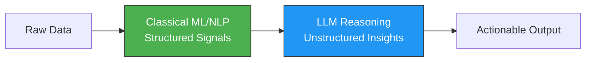
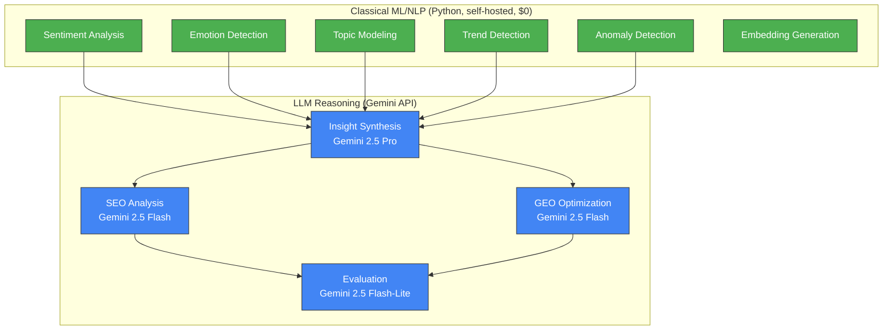

# 04 — ML, NLP & LLM Pipeline

## Architecture Principle: ML First, LLM Second



**Boundary rule**: Use classical ML/NLP for anything that can be reliably done without an LLM (sentiment, clustering, trend detection, anomaly detection). Use LLMs only for tasks requiring reasoning, synthesis, or creative generation.

---

## Classical ML/NLP Pipelines

### Pipeline 1: Sentiment Analysis

| Property | Value |
|---|---|
| **Model** | `cardiffnlp/twitter-roberta-base-sentiment-latest` |
| **Type** | Fine-tuned RoBERTa (125M params) |
| **Output** | `positive` / `negative` / `neutral` + probability scores |
| **Latency** | ~5ms per text (GPU), ~50ms (CPU) |
| **Why this model** | Specifically trained on tweets; excellent for short social media text; open-source; no API cost |

```python
from transformers import pipeline

sentiment_pipe = pipeline(
    "sentiment-analysis",
    model="cardiffnlp/twitter-roberta-base-sentiment-latest",
    device=0  # GPU
)

# Batch processing
results = sentiment_pipe(texts, batch_size=64, truncation=True, max_length=512)
# [{"label": "positive", "score": 0.92}, ...]
```

### Pipeline 2: Emotion Detection

| Property | Value |
|---|---|
| **Model** | `SamLowe/roberta-base-go_emotions` |
| **Type** | Fine-tuned RoBERTa on GoEmotions (28 emotion labels) |
| **Output** | Multi-label: probability per emotion |
| **Latency** | ~8ms per text (GPU), ~80ms (CPU) |
| **Why this model** | 28 fine-grained emotions; trained on Reddit data (perfect for our use case); open-source |

```python
def aggregate_emotions(items: list[dict], topic_id: str) -> dict:
    """Weighted aggregation by engagement score."""
    weighted_emotions = defaultdict(float)
    total_weight = 0
    
    for item in items:
        weight = item["engagement_score"]
        total_weight += weight
        for emotion, score in item["emotions"].items():
            weighted_emotions[emotion] += score * weight
    
    return {k: v / total_weight for k, v in weighted_emotions.items()}
```

### Pipeline 3: Topic Modeling (BERTopic)

| Property | Value |
|---|---|
| **Algorithm** | BERTopic (UMAP → HDBSCAN → c-TF-IDF) |
| **Embeddings** | Pre-computed from `all-MiniLM-L6-v2` (384-dim) |
| **Why BERTopic** | Handles short texts well; interpretable topic labels; dynamic topic modeling; no fixed topic count |

```python
from bertopic import BERTopic
from umap import UMAP
from hdbscan import HDBSCAN

umap_model = UMAP(n_neighbors=15, n_components=5, min_dist=0.0, metric='cosine')
hdbscan_model = HDBSCAN(min_cluster_size=15, metric='euclidean', prediction_data=True)

topic_model = BERTopic(
    umap_model=umap_model,
    hdbscan_model=hdbscan_model,
    embedding_model=None,  # Pre-computed embeddings
    nr_topics="auto",
    top_n_words=10,
    verbose=True
)

topics, probs = topic_model.fit_transform(documents, embeddings=precomputed_embeddings)
```

### Pipeline 4: Trend Detection

| Property | Value |
|---|---|
| **Method** | Statistical time-series analysis + engagement rate-of-change |
| **Algorithms** | Exponential moving averages, Z-score anomaly detection, Prophet forecasting |
| **Why not ML** | Time-series trend detection is well-solved by classical statistics; no training data needed |

```python
import numpy as np
from scipy import stats

def detect_trends(keyword_series: pd.DataFrame) -> list[TrendSignal]:
    trends = []
    for keyword, group in keyword_series.groupby("keyword"):
        recent = group.tail(7)["engagement"].mean()
        previous = group.tail(14).head(7)["engagement"].mean()
        momentum_7d = (recent - previous) / max(previous, 1)
        
        recent_30 = group.tail(30)["engagement"].mean()
        previous_30 = group.tail(60).head(30)["engagement"].mean()
        momentum_30d = (recent_30 - previous_30) / max(previous_30, 1)
        
        z_score = stats.zscore(group["engagement"].values)[-1]
        direction = classify_trend(momentum_7d, momentum_30d, z_score)
        
        trends.append(TrendSignal(
            keyword=keyword, direction=direction,
            momentum_7d=momentum_7d, momentum_30d=momentum_30d,
            z_score=z_score, confidence=calculate_confidence(group)
        ))
    return trends
```

### Pipeline 5: Anomaly / Virality Detection

| Property | Value |
|---|---|
| **Method** | Isolation Forest + statistical outlier detection |
| **Features** | Engagement rate, velocity (engagement/time), ratio metrics |
| **Threshold** | Content items > 3σ above mean engagement for their platform/type |

```python
from sklearn.ensemble import IsolationForest

def detect_viral_outliers(items: pd.DataFrame) -> pd.DataFrame:
    features = items[["engagement_rate", "velocity", "comment_ratio", "share_ratio"]]
    iso_forest = IsolationForest(contamination=0.05, random_state=42)
    items["is_outlier"] = iso_forest.fit_predict(features)
    items["anomaly_score"] = iso_forest.decision_function(features)
    return items[items["is_outlier"] == -1].sort_values("anomaly_score")
```

---

## LLM Reasoning Tasks (Gemini for Development Phase)

> [!IMPORTANT]
> **Development Phase Strategy**: Use **Google Gemini APIs** exclusively during development.
> - **Free tier** available for prototyping (rate-limited but $0 cost)
> - **Paid tier** is extremely cost-effective ($0.10–$0.30/M input tokens)
> - Swap to OpenAI/Anthropic for production if needed — prompts are model-agnostic
> - LangChain's model abstraction makes provider switching trivial

### Gemini Integration via LangChain

```python
from langchain_google_genai import ChatGoogleGenerativeAI

# Heavy reasoning tasks
gemini_pro = ChatGoogleGenerativeAI(
    model="gemini-2.5-pro",
    google_api_key=os.environ["GOOGLE_API_KEY"],
    temperature=0.3,
)

# Balanced tasks (SEO, GEO)
gemini_flash = ChatGoogleGenerativeAI(
    model="gemini-2.5-flash",
    google_api_key=os.environ["GOOGLE_API_KEY"],
    temperature=0.2,
)

# Fast/cheap tasks (evaluation, classification)
gemini_lite = ChatGoogleGenerativeAI(
    model="gemini-2.5-flash-lite",
    google_api_key=os.environ["GOOGLE_API_KEY"],
    temperature=0.1,
)
```

### Task 1: Insight Synthesis (Gemini 2.5 Pro)

**Purpose**: Combine structured ML signals into narrative insights.

> Gemini 2.5 Pro chosen: state-of-the-art reasoning quality, 1M token context window, excellent at structured JSON output. Free tier for dev.

```python
INSIGHT_SYNTHESIS_PROMPT = """
You are a senior market research analyst. Given the following structured signals 
from our ML pipelines, synthesize actionable market insights.

## Trend Signals
{trend_signals}

## Sentiment Summary
{sentiment_summary}

## Emotion Patterns
{emotion_patterns}

## Topic Clusters
{topic_clusters}

## Viral Outliers
{viral_outliers}

Produce insights in the following JSON structure:
{{
  "content_gaps": [...],
  "viral_patterns": [...],
  "audience_signals": [...],
  "risk_signals": [...],
  "opportunity_score": float
}}

Rules:
- Every insight MUST cite specific data points from the signals above
- Do not hallucinate trends not present in the data
- Be specific: name topics, subreddits, keywords, not vague categories
"""
```

### Task 2: SEO Keyword Analysis (Gemini 2.5 Flash)

**Purpose**: Classify keyword intent and identify opportunities.

> Gemini 2.5 Flash chosen: hybrid reasoning model with thinking budgets — excellent balance of speed and quality for structured classification.

```python
SEO_ANALYSIS_PROMPT = """
For each keyword/topic below, analyze:
1. Search intent (informational / commercial / transactional / navigational)
2. Competition level estimate (low / medium / high)
3. Content format fit (blog, video, infographic, tool, comparison)
4. Long-tail variations worth targeting

Keywords: {keywords}
Niche context: {niche}
"""
```

### Task 3: GEO Optimization (Gemini 2.5 Flash)

**Purpose**: Structure content recommendations for AI answer engine visibility.

> Gemini 2.5 Flash chosen: good instruction-following for structured formatting at low cost. In production, can swap to Claude 3.5 Sonnet for superior structure quality if needed.

```python
GEO_OPTIMIZATION_PROMPT = """
You are a Generative Engine Optimization (GEO) specialist. 
For the following content recommendation, optimize it for visibility 
in AI-powered answer engines (Google AI Overviews, ChatGPT Browse, Perplexity).

Content: {recommendation}

Produce:
1. Structured answer format (how to format for featured snippets / AI citations)
2. Key entities to emphasize (for knowledge graph matching)
3. Claim-based structure (citation-worthy factual claims)
4. Schema markup recommendations
5. FAQ section suggestions (questions AI engines commonly answer)
"""
```

### Task 4: Evaluation / Critique (Gemini 2.5 Flash-Lite)

**Purpose**: Validate insight quality and recommendation actionability.

> Gemini 2.5 Flash-Lite chosen: smallest and most cost-effective model — perfect for binary pass/fail evaluation tasks. $0.10/M input, $0.40/M output.

---

## Model Comparison & Cost Estimates

### Development Phase — Gemini Models

| Model | Provider | Cost (per 1M tokens) | Latency | Quality | Use in Platform |
|---|---|---|---|---|---|
| **Gemini 2.5 Pro** | Google | $1.25 in / $10 out (paid) | ~2s | Excellent | Insight synthesis, content ideation |
| **Gemini 2.5 Flash** | Google | $0.30 in / $2.50 out (paid) | ~0.8s | Very Good | SEO analysis, GEO optimization |
| **Gemini 2.5 Flash-Lite** | Google | $0.10 in / $0.40 out (paid) | ~0.3s | Good | Evaluation, classification |
| `twitter-roberta` | HuggingFace | Free (self-hosted) | ~5ms | Excellent (domain) | Sentiment analysis |
| `go_emotions` | HuggingFace | Free (self-hosted) | ~8ms | Good | Emotion detection |
| `all-MiniLM-L6-v2` | HuggingFace | Free (self-hosted) | ~3ms | Good | Embeddings |

### Production Phase — Alternative LLMs (Future)

| Model | Provider | Cost (per 1M tokens) | When to Switch |
|---|---|---|---|
| GPT-4o | OpenAI | $2.50 in / $10 out | If reasoning quality needs improvement |
| GPT-4o-mini | OpenAI | $0.15 in / $0.60 out | Ultra-cheap classification at scale |
| Claude 3.5 Sonnet | Anthropic | $3 in / $15 out | If GEO structuring quality is insufficient |

> [!TIP]
> **LangChain model abstraction** makes switching trivial — just change the model class and API key. No prompt changes needed.

---

### Development Phase Cost Estimate

| Component | Volume/month | Cost |
|---|---|---|
| **Gemini Free Tier** | Limited rate (sufficient for dev) | **$0** |
| Gemini 2.5 Pro (if exceeding free tier) | ~1M tokens | ~$11 |
| Gemini 2.5 Flash (if exceeding free tier) | ~3M tokens | ~$8 |
| Gemini 2.5 Flash-Lite (if exceeding free tier) | ~2M tokens | ~$1 |
| **Total LLM (Dev, paid tier)** | | **~$20/mo max** |
| **Total LLM (Dev, free tier)** | | **~$0** |

---

## ML ↔ LLM Boundary Diagram


