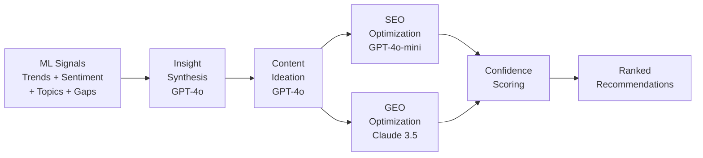

# 06 — Recommendation Engine: Content Recommendations, SEO & GEO

## Overview

The recommendation engine is the core value proposition. It transforms raw signals into **actionable, ranked content recommendations** that are optimized for both traditional SEO and next-gen GEO (Generative Engine Optimization).



---

## Recommendation Pipeline

### Step 1: Content Gap Identification

Content gaps are identified by comparing **demand signals** (what people are searching/asking about) with **supply signals** (what content already exists).

```python
def identify_content_gaps(
    trends: list[TrendSignal],
    topics: list[TopicCluster],
    existing_content: list[ContentItem]
) -> list[ContentGap]:
    gaps = []
    
    for trend in trends:
        if trend.direction in ("emerging", "viral"):
            # Check if existing content covers this trend
            supply = semantic_search(
                query=trend.keyword,
                collection=existing_content,
                threshold=0.75
            )
            
            if len(supply) < 3:  # Low content supply
                gaps.append(ContentGap(
                    topic=trend.keyword,
                    demand_score=trend.momentum_7d,
                    supply_count=len(supply),
                    opportunity_score=trend.momentum_7d / max(len(supply), 1),
                    platform=trend.platform,
                    related_topics=[t for t in topics if trend.keyword in t.keywords]
                ))
    
    return sorted(gaps, key=lambda g: g.opportunity_score, reverse=True)
```

### Step 2: Content Ideation (LLM)

GPT-4o generates niche-specific content ideas from identified gaps and insights.

**Key inputs:**
- Top content gaps (sorted by opportunity score)
- Trend direction + sentiment context
- Viral content patterns (what format/angle performs best)
- Audience questions (from Reddit/X discourse)

**Output per idea:**
- Title (draft)
- Content angle (unique perspective or hook)
- Target audience segment
- Suggested format (blog, video script, infographic, comparison, etc.)
- Estimated difficulty (research/creation effort)

### Step 3: SEO Optimization (GPT-4o-mini)

For each content idea, the SEO agent produces:

| Output | Description |
|---|---|
| **Primary keyword** | Main target keyword (1-3 words) |
| **Long-tail keywords** | 3-5 specific variations |
| **Keyword intent** | informational / commercial / transactional / navigational |
| **Title variants** | 3 SEO-optimized title options |
| **Meta description** | 155-char search snippet |
| **Content structure** | H2/H3 outline optimized for featured snippets |
| **Internal linking suggestions** | Related topics to cross-link |
| **Estimated competition** | low / medium / high (from signal density) |

### Step 4: GEO Optimization (Claude 3.5 Sonnet)

GEO ensures content is structured for visibility in AI answer engines.

| GEO Element | Description |
|---|---|
| **Structured answer format** | How to format for AI citation (lists, tables, definitions) |
| **Key entities** | Named entities to emphasize for knowledge graph matching |
| **Citation-worthy claims** | Factual, data-backed claims that AI engines prefer to cite |
| **Authoritative framing** | E-E-A-T signals (Experience, Expertise, Authority, Trust) |
| **FAQ structure** | Questions AI engines commonly answer, formatted as Q&A |
| **Schema markup** | Recommended JSON-LD types (FAQ, HowTo, Article) |

---

## Confidence Scoring

Each recommendation receives a composite confidence score:

```python
def calculate_confidence(rec: Recommendation) -> float:
    weights = {
        "trend_strength": 0.25,      # How strong is the underlying trend?
        "gap_opportunity": 0.20,      # How big is the content gap?
        "sentiment_alignment": 0.15,  # Is audience sentiment favorable?
        "data_freshness": 0.15,       # How recent is the supporting data?
        "signal_diversity": 0.15,     # Multiple platforms confirming?
        "competition_inverse": 0.10,  # Lower competition = higher score
    }
    
    score = (
        weights["trend_strength"] * rec.trend_momentum +
        weights["gap_opportunity"] * rec.gap_score +
        weights["sentiment_alignment"] * rec.sentiment_score +
        weights["data_freshness"] * rec.freshness_score +
        weights["signal_diversity"] * rec.cross_platform_score +
        weights["competition_inverse"] * (1 - rec.competition_score)
    )
    
    return round(min(max(score, 0.0), 1.0), 2)
```

### Confidence Thresholds

| Range | Label | Action |
|---|---|---|
| 0.8 - 1.0 | High Confidence | Strongly recommended; prominent in dashboard |
| 0.6 - 0.79 | Medium Confidence | Recommended with caveats |
| 0.4 - 0.59 | Low Confidence | Shown with "exploratory" label |
| < 0.4 | Insufficient | Filtered out or flagged for manual review |

---

## Full Recommendation Output Schema

```typescript
interface Recommendation {
  id: string;
  
  // Core content idea
  title: string;
  content_angle: string;
  target_audience: string;
  suggested_format: "blog" | "video" | "infographic" | "comparison" | "guide" | "tool";
  estimated_effort: "low" | "medium" | "high";
  
  // SEO layer
  seo: {
    primary_keyword: string;
    long_tail_keywords: string[];
    keyword_intent: "informational" | "commercial" | "transactional" | "navigational";
    title_variants: string[];
    meta_description: string;
    content_outline: OutlineSection[];
    estimated_competition: "low" | "medium" | "high";
    seo_score: number;  // 0-1
  };
  
  // GEO layer
  geo: {
    structured_answer_format: boolean;
    key_entities: string[];
    citation_worthy_claims: number;
    recommended_structure: string;
    faq_suggestions: { question: string; answer_hint: string }[];
    schema_markup: string[];  // e.g., ["FAQPage", "HowTo"]
    geo_score: number;  // 0-1
  };
  
  // Scoring & provenance
  confidence: number;  // 0-1 composite score
  reasoning: string;   // LLM-generated explanation
  source_trends: string[];    // IDs of supporting trend signals
  source_platforms: string[]; // Which platforms contributed data
  
  // Metadata
  created_at: string;
  analysis_run_id: string;
  evaluation_passed: boolean;
}
```

---

## Niche Configuration

Users configure their niche/industry to get relevant recommendations:

```typescript
interface NicheConfig {
  id: string;
  name: string;                    // e.g., "AI SaaS Tools"
  keywords: string[];              // Seed keywords
  subreddits: string[];            // Monitored subreddits
  twitter_accounts: string[];     // Monitored Twitter accounts
  youtube_channels: string[];     // Monitored YouTube channels
  competitors: string[];          // Competitor domains/channels
  content_formats: string[];      // Preferred formats
  target_audience: string;        // Brief audience description
}
```

This config drives:
- Apify scraper inputs (what subreddits, accounts, channels to scrape)
- Trend detection scope (what keywords to track)
- Recommendation filtering (relevance to niche)
- SEO keyword context (industry-specific optimization)
