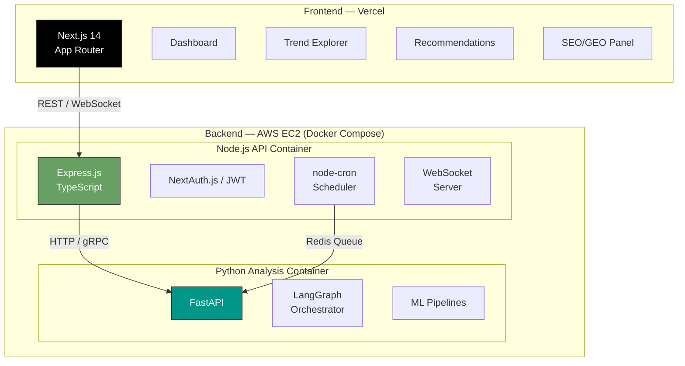
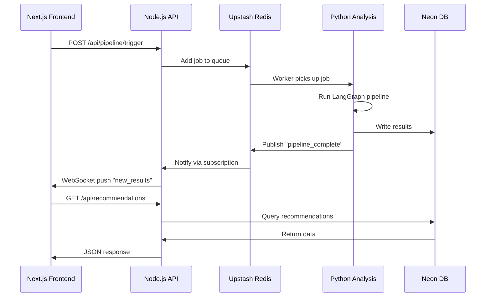

# 07 — Frontend & Backend Architecture

## Architecture Split



---

## Frontend (Next.js on Vercel)

### Tech Stack
| Technology | Purpose |
|---|---|
| **Next.js 14** (App Router) | React framework with SSR/ISR |
| **TypeScript** | Type safety |
| **Recharts / Nivo** | Data visualization (charts, sparklines) |
| **TanStack Query** | Data fetching, caching, mutations |
| **Zustand** | Client-side state management |
| **Socket.io client** | Real-time updates from WebSocket |
| **Tailwind CSS** | Utility-first styling |
| **Vercel** | Hosting with edge functions |

### Page Structure

```
app/
├── layout.tsx              # Root layout with auth wrapper
├── page.tsx                # Landing / login redirect
├── dashboard/
│   └── page.tsx            # Main dashboard (KPIs, alerts, sparklines)
├── trends/
│   ├── page.tsx            # Trend explorer (timeline, heatmaps)
│   └── [keyword]/page.tsx  # Trend detail (specific keyword deep-dive)
├── recommendations/
│   ├── page.tsx            # Ranked recommendations list
│   └── [id]/page.tsx       # Recommendation detail (SEO + GEO breakdown)
├── seo/
│   └── page.tsx            # SEO intelligence panel
├── geo/
│   └── page.tsx            # GEO optimization panel
├── settings/
│   ├── page.tsx            # Niche configuration
│   └── platforms/page.tsx  # Platform connection settings
└── api/
    └── auth/[...nextauth]/ # NextAuth.js API routes
```

### Dashboard Components

| Component | Description | Data Source |
|---|---|---|
| **KPI Cards** | Total content tracked, trend count, avg sentiment | Aggregated from Neon |
| **Trend Sparklines** | Mini charts for top 5 trending keywords | `trend_signals` table |
| **Alert Feed** | New viral outliers, sentiment shifts, emerging topics | WebSocket push |
| **Platform Status** | Last ingestion time, item counts per platform | `analysis_runs` table |
| **Top Recommendations** | Top 3 highest-confidence recommendations | `recommendations` table |
| **Sentiment Heatmap** | Emotion distribution over time by topic | `sentiment_results` + views |

### Data Fetching Strategy

```typescript
// Using TanStack Query with ISR
export default function DashboardPage() {
  const { data: trends } = useQuery({
    queryKey: ['trends', 'top'],
    queryFn: () => api.get('/api/trends/top?limit=10'),
    staleTime: 5 * 60 * 1000,  // 5 min cache
    refetchInterval: 60 * 1000, // Refetch every 60s
  });

  const { data: alerts } = useQuery({
    queryKey: ['alerts', 'recent'],
    queryFn: () => api.get('/api/alerts/recent'),
  });
  
  // WebSocket for real-time alerts
  useEffect(() => {
    const socket = io(process.env.NEXT_PUBLIC_WS_URL);
    socket.on('new_alert', (alert) => {
      queryClient.invalidateQueries(['alerts']);
    });
    return () => socket.disconnect();
  }, []);
}
```

---

## Backend — Node.js API Gateway

### Tech Stack
| Technology | Purpose |
|---|---|
| **Express.js** | HTTP API framework |
| **TypeScript** | Type safety |
| **Prisma** | ORM for Neon PostgreSQL |
| **Socket.io** | WebSocket server for real-time |
| **node-cron** | Schedule pipeline triggers |
| **BullMQ** | Job queue (via Upstash Redis) |
| **Helmet + cors** | Security middleware |
| **Zod** | Request validation |

### API Routes

```
Routes:
├── /api/auth/*              # NextAuth.js handlers
├── /api/dashboard
│   └── GET /kpis            # Dashboard KPI summary
│   └── GET /alerts          # Recent alerts/notifications
├── /api/trends
│   ├── GET /top             # Top trending keywords
│   ├── GET /:keyword        # Keyword trend detail
│   └── GET /timeline        # Trend timeline data
├── /api/recommendations
│   ├── GET /                # List recommendations (paginated)
│   ├── GET /:id             # Recommendation detail
│   └── POST /generate       # Trigger new recommendation run
├── /api/seo
│   ├── GET /keywords        # SEO keyword opportunities
│   └── GET /analysis/:id    # SEO analysis for a recommendation
├── /api/geo
│   └── GET /analysis/:id    # GEO analysis for a recommendation
├── /api/content
│   ├── GET /                # Browse platform content
│   ├── GET /search          # Semantic search via pgvector
│   └── GET /outliers        # Viral outliers
├── /api/niches
│   ├── GET /                # List user niches
│   ├── POST /               # Create niche config
│   └── PUT /:id             # Update niche config
├── /api/pipeline
│   ├── POST /trigger        # Manually trigger full pipeline
│   ├── GET /status          # Current pipeline run status
│   └── GET /history         # Past run history
└── /api/webhooks
    └── POST /apify          # Apify webhook notifications
```

### Scheduling

```typescript
import cron from 'node-cron';
import { Queue } from 'bullmq';

const pipelineQueue = new Queue('pipeline', {
  connection: { url: process.env.UPSTASH_REDIS_REST_URL }
});

// Schedule full pipeline runs
cron.schedule('0 */4 * * *', async () => {
  // Every 4 hours: trigger ingestion + analysis
  await pipelineQueue.add('full-pipeline', {
    platforms: ['reddit', 'twitter', 'youtube'],
    trigger: 'scheduled'
  });
});

// Schedule trend-only updates (lighter)
cron.schedule('0 * * * *', async () => {
  // Every hour: recalculate trend signals
  await pipelineQueue.add('trend-update', {
    trigger: 'scheduled'
  });
});
```

---

## Backend — Python Analysis Service

### Tech Stack
| Technology | Purpose |
|---|---|
| **FastAPI** | HTTP API for analysis endpoints |
| **LangGraph** | Agent orchestration |
| **LangChain** | Tool abstraction, prompt templates, model invocation |
| **Transformers** | HuggingFace ML models |
| **BERTopic** | Topic modeling |
| **SQLAlchemy** | Neon PostgreSQL ORM |
| **Motor** | Async MongoDB driver |
| **Pydantic** | Data validation + LangGraph state schema |

### API Endpoints

```
FastAPI Routes:
├── POST /pipeline/run         # Execute full LangGraph pipeline
├── POST /pipeline/ingest      # Run ingestion only
├── POST /pipeline/analyze     # Run analysis only (assume data exists)
├── GET  /pipeline/status/{id} # Pipeline run status
├── POST /search/semantic      # Semantic similarity search
├── GET  /health               # Health check
└── WS   /pipeline/stream      # Stream pipeline progress via WebSocket
```

### Inter-Service Communication



---

## Authentication

| Aspect | Choice |
|---|---|
| **Provider** | NextAuth.js v5 (Auth.js) |
| **Strategy** | OAuth (Google, GitHub) + Email/Password |
| **Session** | JWT stored in HTTP-only cookie |
| **API Protection** | JWT verification middleware on all `/api/*` routes |
| **Python Service** | Internal-only (not exposed publicly); authenticated via shared API key |

---

## Deployment

### AWS EC2 Backend Architecture

Both backend services (Node.js + Python) run on a **single EC2 instance** using Docker Compose, fronted by Nginx as a reverse proxy.

```
EC2 Instance (t3.medium — 2 vCPU, 4 GB RAM)
├── Nginx (reverse proxy, SSL termination)
├── Docker Container: Node.js API (port 3001)
├── Docker Container: Python Analysis (port 8000)
└── Docker Container: Redis (local cache, optional)
```

**Docker Compose setup:**
```yaml
version: '3.8'
services:
  node-api:
    build: ./api
    ports: ["3001:3001"]
    env_file: .env
    restart: always
    
  python-analysis:
    build: ./analysis
    ports: ["8000:8000"]
    env_file: .env
    restart: always
    deploy:
      resources:
        limits:
          memory: 2G

  nginx:
    image: nginx:alpine
    ports: ["80:80", "443:443"]
    volumes:
      - ./nginx.conf:/etc/nginx/nginx.conf
      - ./certs:/etc/ssl/certs
    depends_on: [node-api, python-analysis]
    restart: always
```

### Deployment Table

| Service | Host | Estimated Cost |
|---|---|---|
| **Next.js Frontend** | Vercel (Hobby → Pro) | $0 - $20/mo |
| **Node.js API + Python** | AWS EC2 `t3.medium` (Docker Compose) | ~$30/mo ($0 with credits) |
| **Neon PostgreSQL** | Neon (Free → $19/mo Launch) | $0 - $19/mo |
| **MongoDB Atlas** | MongoDB (Free → $9/mo M2) | $0 - $9/mo |
| **Upstash Redis** | Upstash (Free → pay-as-you-go) | $0 - $5/mo |

> [!TIP]
> **$100 AWS Free Credits**: A `t3.medium` costs ~$30/mo, so credits cover **~3 months** of backend hosting. For ML inference, CPU batch processing is fine at dev scale. Upgrade to `g4dn.xlarge` (~$380/mo) only if you need GPU at production scale.

### EC2 Instance Sizing Guide

| Instance | vCPU | RAM | Cost/mo | Best For |
|---|---|---|---|---|
| `t3.small` | 2 | 2 GB | ~$15 | Light dev, testing |
| `t3.medium` | 2 | 4 GB | ~$30 | **Dev + MVP (recommended)** |
| `t3.large` | 2 | 8 GB | ~$60 | MVP + moderate ML workload |
| `m5.large` | 2 | 8 GB | ~$70 | Production (dedicated) |
| `g4dn.xlarge` | 4 | 16 GB + GPU | ~$380 | GPU ML inference at scale |

### Total Monthly Cost Estimate

| Phase | Estimated Monthly Cost |
|---|---|
| **Development (free credits)** | ~$5-10 (only GetXAPI + incidentals) |
| **MVP (low traffic)** | ~$80 - $120/mo |
| **Production (moderate)** | ~$250 - $450/mo |
| **Scale (high traffic)** | ~$600 - $1200/mo |
