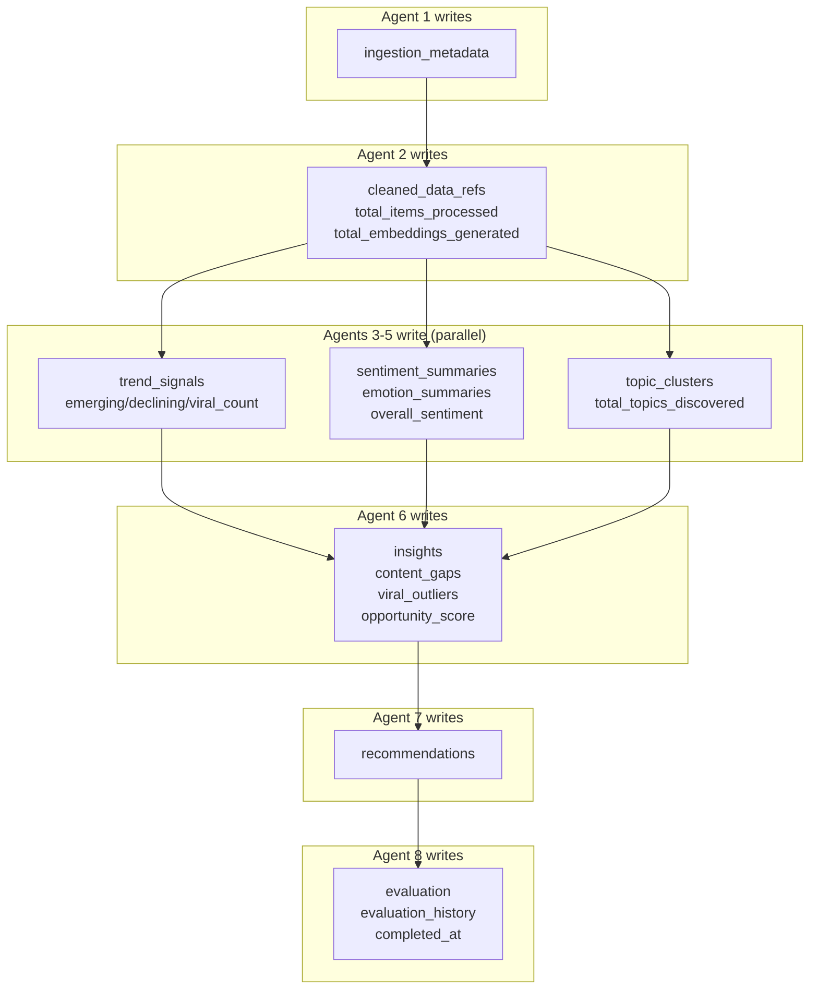

# 09 — LangGraph State Schema Design

## Overview

The LangGraph `PlatformState` is the shared, typed state that flows between all 8 agents. Each agent reads relevant portions and writes its outputs, which the graph framework merges via reducer functions.

---

## State Schema (Pydantic v2)

```python
from pydantic import BaseModel, Field
from typing import Optional, Literal
from datetime import datetime
from enum import Enum


# ─── Sub-Models ───────────────────────────────────────────────────────

class PlatformEnum(str, Enum):
    REDDIT = "reddit"
    TWITTER = "twitter"
    YOUTUBE = "youtube"


class IngestionMetadata(BaseModel):
    """Metadata from a single platform ingestion run."""
    platform: PlatformEnum
    items_fetched: int = 0
    items_new: int = 0           # After deduplication
    items_failed: int = 0
    timestamp: datetime
    status: Literal["success", "partial", "failed"] = "success"
    error_message: Optional[str] = None
    batch_id: str


class CleanedDataRef(BaseModel):
    """Reference to cleaned data stored in Neon."""
    platform: PlatformEnum
    item_count: int
    content_ids: list[str]      # UUIDs of content_items rows
    embedding_count: int
    languages_detected: dict[str, int]  # {"en": 450, "es": 12}


class TrendSignal(BaseModel):
    """A detected trend for a keyword/topic."""
    keyword: str
    platform: PlatformEnum
    direction: Literal["emerging", "declining", "stable", "viral"]
    momentum_7d: float          # Rate of change (7-day window)
    momentum_30d: float         # Rate of change (30-day window)
    volume_current: int
    volume_previous: int
    z_score: float              # Anomaly score
    confidence: float           # 0.0 - 1.0
    detected_at: datetime = Field(default_factory=datetime.utcnow)


class SentimentSummary(BaseModel):
    """Aggregated sentiment for a topic or platform."""
    scope: str                  # "global", topic name, or platform
    positive_ratio: float
    negative_ratio: float
    neutral_ratio: float
    dominant_sentiment: Literal["positive", "negative", "neutral"]
    sample_size: int
    weighted_by_engagement: bool = True


class EmotionSummary(BaseModel):
    """Aggregated emotion distribution."""
    scope: str
    emotions: dict[str, float]  # {"joy": 0.35, "anger": 0.12, ...}
    dominant_emotion: str
    emotional_intensity: float  # Average intensity (0-1)
    sample_size: int


class TopicCluster(BaseModel):
    """A topic cluster from BERTopic."""
    cluster_id: int
    label: str                  # Human-readable label
    keywords: list[str]         # Top keywords (c-TF-IDF)
    doc_count: int
    representative_doc_ids: list[str]  # UUIDs
    avg_sentiment: float
    dominant_emotion: str
    trend_direction: Optional[str] = None


class ContentGap(BaseModel):
    """An identified gap between demand and supply."""
    topic: str
    demand_score: float         # Derived from trend momentum
    supply_count: int           # Existing content count
    opportunity_score: float    # demand / supply
    platforms: list[PlatformEnum]
    related_keywords: list[str]


class ViralOutlier(BaseModel):
    """A content item detected as statistically anomalous."""
    content_id: str
    platform: PlatformEnum
    title: str
    engagement_score: float
    anomaly_score: float        # From Isolation Forest
    velocity: float             # Engagement per hour
    attributes: dict            # What makes it viral


class Insight(BaseModel):
    """A synthesized market insight from LLM reasoning."""
    category: Literal["content_gap", "viral_pattern", "audience_signal", "risk_signal"]
    title: str
    description: str
    supporting_data: list[str]  # References to specific data points
    confidence: float
    actionability: Literal["high", "medium", "low"]


class SEOAnalysis(BaseModel):
    """SEO optimization layer for a recommendation."""
    primary_keyword: str
    long_tail_keywords: list[str]
    keyword_intent: Literal["informational", "commercial", "transactional", "navigational"]
    title_variants: list[str]
    meta_description: str
    content_outline: list[dict]  # [{heading, subpoints}]
    estimated_competition: Literal["low", "medium", "high"]
    seo_score: float


class GEOAnalysis(BaseModel):
    """GEO optimization layer for a recommendation."""
    structured_answer_format: bool
    key_entities: list[str]
    citation_worthy_claims: int
    recommended_structure: str
    faq_suggestions: list[dict]  # [{question, answer_hint}]
    schema_markup: list[str]
    geo_score: float


class Recommendation(BaseModel):
    """A complete content recommendation."""
    id: str
    title: str
    content_angle: str
    target_audience: str
    suggested_format: Literal["blog", "video", "infographic", "comparison", "guide", "tool"]
    estimated_effort: Literal["low", "medium", "high"]
    seo: SEOAnalysis
    geo: GEOAnalysis
    confidence: float
    reasoning: str
    source_trends: list[str]
    source_platforms: list[str]


class EvaluationResult(BaseModel):
    """Output from the evaluator/critic agent."""
    overall_pass: bool
    confidence_score: float
    insight_quality: float
    recommendation_actionability: float
    hallucination_risk: float
    correlation_strength: float
    feedback: str
    route_to: Literal["end", "insight_agent", "recommendation_agent"]
    iteration: int = 0


# ─── Main State ───────────────────────────────────────────────────────

class PlatformState(BaseModel):
    """
    Shared state for the LangGraph pipeline.
    All agents read from and write to this state.
    """
    # ── Run metadata ──
    run_id: str
    niche_id: str
    active_platforms: list[PlatformEnum] = [
        PlatformEnum.REDDIT, PlatformEnum.TWITTER, PlatformEnum.YOUTUBE
    ]
    started_at: datetime = Field(default_factory=datetime.utcnow)
    
    # ── Agent 1: Ingestion outputs ──
    ingestion_metadata: list[IngestionMetadata] = []
    
    # ── Agent 2: Preprocessing outputs ──
    cleaned_data_refs: list[CleanedDataRef] = []
    total_items_processed: int = 0
    total_embeddings_generated: int = 0
    
    # ── Agent 3: Trend detection outputs ──
    trend_signals: list[TrendSignal] = []
    emerging_count: int = 0
    declining_count: int = 0
    viral_count: int = 0
    
    # ── Agent 4: Sentiment & emotion outputs ──
    sentiment_summaries: list[SentimentSummary] = []
    emotion_summaries: list[EmotionSummary] = []
    overall_sentiment: Optional[str] = None
    
    # ── Agent 5: Topic clustering outputs ──
    topic_clusters: list[TopicCluster] = []
    total_topics_discovered: int = 0
    
    # ── Cross-agent derived data ──
    content_gaps: list[ContentGap] = []
    viral_outliers: list[ViralOutlier] = []
    
    # ── Agent 6: Insight synthesis outputs ──
    insights: list[Insight] = []
    opportunity_score: float = 0.0
    
    # ── Agent 7: Recommendation outputs ──
    recommendations: list[Recommendation] = []
    
    # ── Agent 8: Evaluation outputs ──
    evaluation: Optional[EvaluationResult] = None
    evaluation_history: list[EvaluationResult] = []
    max_refinement_iterations: int = 2
    
    # ── Pipeline metadata ──
    completed_at: Optional[datetime] = None
    errors: list[str] = []
    warnings: list[str] = []
```

---

## State Reducers (LangGraph Annotations)

For LangGraph, list fields should use **add** reducers to accumulate values across agent invocations:

```python
from typing import Annotated
from langgraph.graph import add_messages
import operator

class PlatformStateAnnotated(TypedDict):
    """TypedDict version with LangGraph reducer annotations."""
    run_id: str
    niche_id: str
    active_platforms: list[str]
    
    # List fields use 'add' reducer (append, don't replace)
    ingestion_metadata: Annotated[list, operator.add]
    cleaned_data_refs: Annotated[list, operator.add]
    trend_signals: Annotated[list, operator.add]
    sentiment_summaries: Annotated[list, operator.add]
    emotion_summaries: Annotated[list, operator.add]
    topic_clusters: Annotated[list, operator.add]
    content_gaps: Annotated[list, operator.add]
    viral_outliers: Annotated[list, operator.add]
    insights: Annotated[list, operator.add]
    recommendations: Annotated[list, operator.add]
    evaluation_history: Annotated[list, operator.add]
    errors: Annotated[list, operator.add]
    warnings: Annotated[list, operator.add]
    
    # Scalar fields use default 'replace' reducer
    total_items_processed: int
    total_embeddings_generated: int
    emerging_count: int
    declining_count: int
    viral_count: int
    overall_sentiment: Optional[str]
    total_topics_discovered: int
    opportunity_score: float
    evaluation: Optional[dict]
    completed_at: Optional[str]
```

---

## State Flow Diagram


